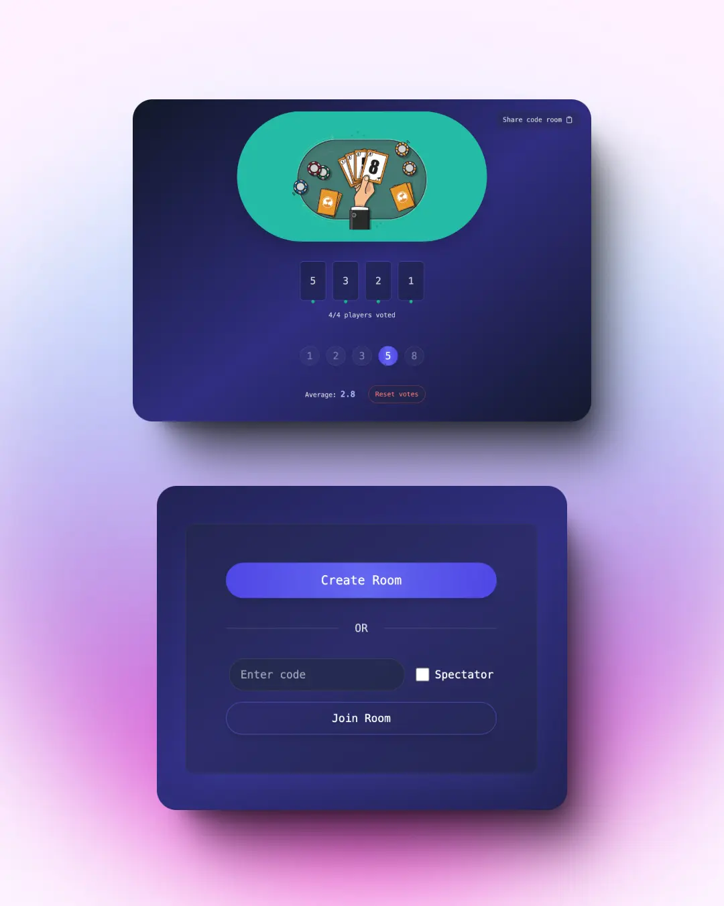

# Salvador Jesús | Front-End Developer

[](https://www.linkedin.com/in/jsalvadev/)
[](https://github.com/jsalvadev)
[](mailto:salvadorjesus.freelance@gmail.com)

## 🚀 About Me

Hi, I'm Salva, Front-End Developer (Angular) at Vueling Airlines. With over 1 year of experience, based in Barcelona, Spain 🇪🇸. I specialize in building digital experiences for the airline industry, taking on freelance projects, and sharing my journey through content creation.


## 💼 Professional Experience

### Front-End Developer | Vueling Airlines

_June 2024 - Present | Barcelona, Spain_

- Spearheaded the modernization initiative by migrating internal employee applications from Angular 10 to Angular 17
- Implemented comprehensive unit testing strategies, achieving 50% code coverage across the application
- Collaborated with UX/UI teams to implement responsive design patterns
- Participated in agile ceremonies and technical planning sessions

## 🛠️ Technical Skills

- **Frontend**: Angular, TypeScript, Astro
- **Styling**: Angular Material, Tailwind CSS
- **Editor**: Zed

## 🎯 Featured Projects

### Planning Poker | Team Estimation Tool



A real-time collaborative application designed to streamline agile estimation sessions for development teams.

**Key Features:**

- Real-time synchronization across team members
- Custom estimation scales (Fibonacci)

**Tech Stack:**

- Angular 17, TypeScript, Tailwind CSS, Firebase Realtime Database

**Links:**

- [Live Demo](https://pppeople.vercel.app/welcome)
- [GitHub Repository](https://github.com/gallianoms/pppeople)

## 🚀 Local Development

```bash
# Clone the repository
git clone https://github.com/jsalvadev/jsalvadev.github.io

# Navigate to project directory
cd jsalvadev.github.io

# Install dependencies
npm install

# Start development server
npm run dev

# Build for production
npm run build
```

## 📫 Let's Connect!

I'm always interested in connecting with fellow developers and potential collaborators. Feel free to reach out through any of these channels:

- 💼 [LinkedIn](https://linkedin.com/in/jsalvadev)
- 🐱 [GitHub](https://github.com/jsalvadev)
- 📧 [salvadorjesus.freelance@gmail.com](mailto:salvadorjesus.freelance@gmail.com)

## 📄 License

This project is licensed under the MIT License

---

<p align="center">Made with ♥ using Astro and Tailwind CSS</p>
